# ScamShield

**An explainable, obfuscation-robust scam SMS detector for the Indian context.**

Paste a suspicious SMS and ScamShield opens a *case file*: a verdict with calibrated confidence, the message
with every word shaded by how much it pushed the verdict, the de-obfuscated text (`0TP` → `OTP`,
`v e r i f y` → `verify`), a forensic check of any link (never opened), the attack pattern behind the
message, and what to do next.

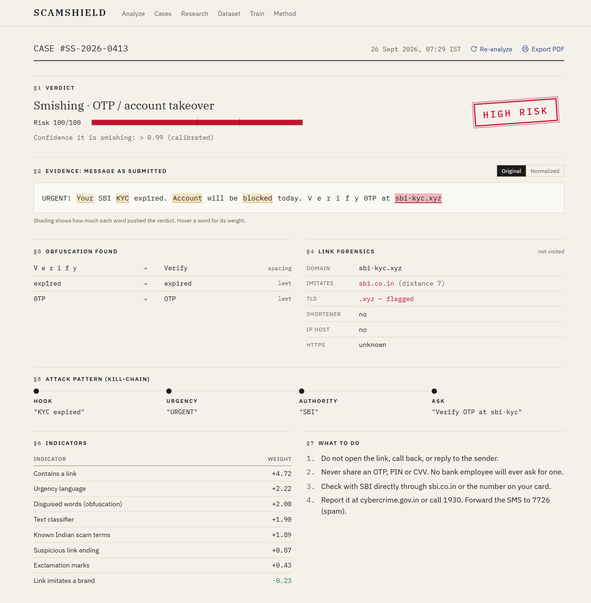

---

## Contents

- [Why this project](#why-this-project)
- [What it does](#what-it-does)
- [How it works](#how-it-works)
- [Data](#data)
- [Models](#models)
- [Experiments and results](#experiments-and-results)
- [Screenshots](#screenshots)
- [Getting started](#getting-started)
- [API](#api)
- [Deployment](#deployment)
- [Project layout](#project-layout)
- [Limitations and future work](#limitations-and-future-work)
- [References](#references)

---

## Why this project

Indian phones receive a steady stream of fraud: fake KYC expiry notices, UPI "collect requests" dressed up
as refunds, courier customs fees, electricity disconnection threats, part-time "task" jobs and "digital
arrest" calls from fake police. Most SMS spam research, however, still trains on the **UCI SMS Spam
Collection**: English messages collected in the UK around 2012. That creates three problems:

| Problem | What goes wrong |
|---|---|
| **Domain shift** | A model that has never seen "UPI", "KYC" or "Aadhaar" misses Indian scams. We measure a **33–52% accuracy drop**. |
| **Obfuscation** | Scammers write `0TP`, `b@nk`, `v e r i f y` exactly because word-based filters stop recognising the word. |
| **Opacity** | A bare "spam" label gives no reason to trust it and no advice on what to do. |

ScamShield addresses all three, and measures each one experimentally.

## What it does

- **Classifies** a message as legitimate, spam (unwanted marketing) or smishing (fraud), and names the scam
  type: KYC, OTP/account takeover, UPI, courier, prize/lottery, job/task, digital arrest, phishing.
- **Undoes obfuscation** (leet, look-alike Cyrillic/Greek letters, spaced and dotted letters, invisible
  characters) and shows every rewrite.
- **Explains the verdict** with a word-level heatmap, named indicators, and the scam's *kill-chain*:
  hook → urgency → claimed authority → demand.
- **Checks links lexically**: look-alikes of ~30 Indian bank and brand domains, shorteners, suspicious
  top-level domains, raw IPs. Links are never visited.
- **Reports calibrated confidence** and flags uncertain messages as *needs human review*.
- **Gives advice** specific to the scam type, plus where to report it (cybercrime.gov.in, 1930).
- **Works from the phone**: installable web app with a share target, so an SMS can be shared straight
  from the messaging app.
- **Teaches**: an awareness quiz that shows how the model reads each message.

## How it works

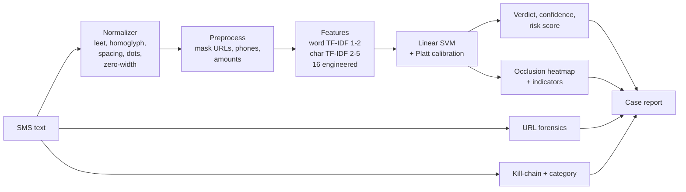

| Stage | Module | Detail |
|---|---|---|
| Normalize | `ml/normalizer.py` | Reverses six obfuscation families while protecting URLs, amounts, OTP codes, phone numbers and texting slang (`gr8`, `7pm`). |
| Features | `ml/preprocess.py`, `ml/features.py` | Word and character TF-IDF plus 16 engineered features: urgency words, requests for OTP/PIN, obfuscation count, URL look-alike score, Indian scam terms. |
| Classify | `ml/train.py` | Calibrated linear SVM, chosen by cross-validation on training data (never on test data). |
| Confidence | `ml/explain.py` | Probability of the label shown; 0.35–0.65 is marked *needs human review*. Promotions are capped at MEDIUM risk: unwanted, but not fraud. |
| Explain | `ml/explain.py`, `ml/risk.py` | Occlusion: remove each word, measure the change in the model's raw margin. Named indicator weights from a small logistic regression. |
| Links | `ml/url_forensics.py` | Edit distance and substring match against official domains, shorteners, TLD list, IP hosts, `@` tricks. |

## Data

| Source | Messages used | Role | License |
|---|---|---|---|
| UCI SMS Spam Collection [1] | 4,836 (after de-duplication) | train + UCI test | CC BY 4.0 |
| Mishra & Soni SMS Phishing [2] | 1,053 (the rest duplicate UCI) | train + MS test | CC BY 4.0 |
| Indian Telecom SMS Spam Collection [3] | 1,854 | Indian test + dev | MIT |
| ScamShield dataset [4], real rows only | 6,985 | Indian test + dev | MIT |
| News / PIB Fact Check reports, published examples | 28 | Indian test + dev | — |
| Templated synthetic messages (`ml/synth.py`) | 1,117 | train only | — |

- **Leak-free splits.** Sources are de-duplicated against each other *before* splitting (5,656 duplicates
  removed), so no test message also appears in training.
- **Labels.** The public Indian sources only say spam or ham, and their "spam" mixes marketing with fraud.
  A documented keyword pass (`ml/import_public.py`) splits it into promotional spam and smishing, and
  records per row how each label was set (`label_method`).
- **Honesty checks.** Machine-generated rows in the ScamShield dataset were excluded and verified absent;
  a machine-generated Hugging Face collection was inspected and rejected.
- **Privacy.** Phone numbers, Aadhaar, PAN, account numbers and e-mail addresses are masked automatically.

**Indian test set: 6,061 messages** (1,017 legitimate, 3,758 promotional spam, 1,286 smishing).

## Models

| Family | Models | Notes |
|---|---|---|
| TF-IDF | Complement Naive Bayes, logistic regression, **linear SVM (deployed)** | Word + char n-grams + engineered features, sigmoid-calibrated |
| Recurrent | Simple RNN, BiLSTM, each **with and without additive attention** | Embeddings learned from scratch; attention: `a_t = softmax(v · tanh(W h_t))`, `c = Σ a_t h_t` |
| Transformer | DistilBERT (`distilbert-base-uncased`) | Fine-tuned 2 epochs on an RTX 3050 laptop GPU |

The linear SVM is deployed because it matches DistilBERT on Indian messages, needs no GPU, and answers in
milliseconds. The neural models are used in the experiments only.

## Experiments and results

All numbers come from `python -m ml.run_all` and are shown live on the app's Research page.

### E1: baseline on UK data

| Model | Accuracy | F1 | Scam recall |
|---|---|---|---|
| Naive Bayes | 0.984 | 0.932 | 0.821 |
| Logistic regression | 0.985 | 0.936 | 0.821 |
| Linear SVM | 0.985 | 0.936 | 0.821 |
| Simple RNN | 0.970 | 0.889 | 0.836 |
| RNN + attention | 0.975 | 0.906 | 0.851 |
| BiLSTM | 0.981 | 0.930 | 0.895 |
| BiLSTM + attention | 0.968 | 0.889 | 0.895 |
| DistilBERT | **0.991** | **0.963** | **0.910** |

On the data they were built for, all models do well.

### E2: domain shift (UK-trained models on Indian messages)

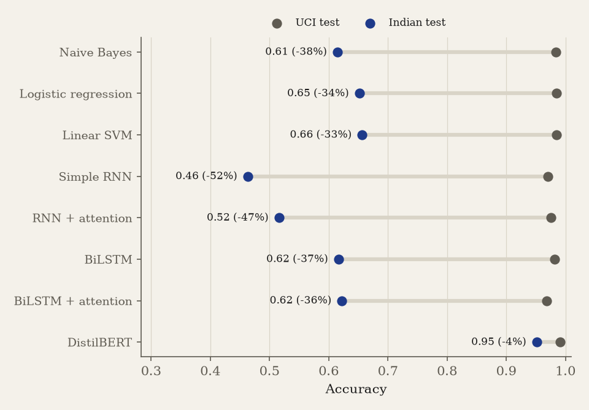

Every model trained from scratch loses **33–52%** of its accuracy on Indian messages. Pretrained DistilBERT
loses only **4%**. The recurrent models vary strongly with the random seed out of domain, so they are
reported as a mean over 5 seeds (RNN 0.46 ± 0.09, RNN + attention 0.52 ± 0.10, BiLSTM 0.62 ± 0.11,
BiLSTM + attention 0.62 ± 0.15).

### E3: recovery with Indian training data (Indian test set, legitimate vs scam)

| Model | Accuracy | F1 | Scam recall | ROC-AUC |
|---|---|---|---|---|
| Naive Bayes | 0.966 | 0.940 | 0.979 | 0.985 |
| Logistic regression | 0.981 | 0.966 | 0.991 | 0.991 |
| **Linear SVM (deployed)** | **0.984** | **0.970** | **0.993** | 0.991 |
| Simple RNN | 0.959 | 0.927 | 0.975 | 0.972 |
| RNN + attention | 0.967 | 0.943 | 0.976 | 0.985 |
| BiLSTM | 0.970 | 0.946 | 0.983 | 0.988 |
| BiLSTM + attention | 0.972 | 0.951 | 0.980 | 0.988 |
| DistilBERT | 0.982 | 0.968 | 0.989 | **0.995** |

With Indian data in training, the linear SVM matches DistilBERT, and attention improves both recurrent
models. The synthetic training messages make no measurable difference once real Indian data is present
(SVM F1 0.974 without them, 0.970 with).

Three-class results (legitimate / spam / smishing) for the linear SVM: accuracy 0.957, macro F1 0.949.

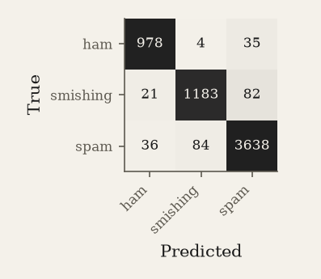

### E4 and E7: robustness to obfuscation

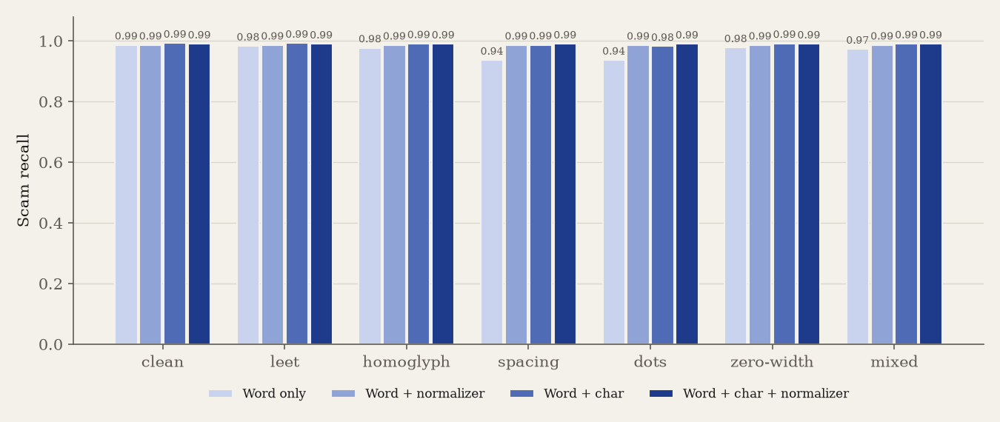

Scam recall on the Indian test set, clean vs the most damaging attack (letter spacing):

| Model | Clean | Spacing attack | + normalizer |
|---|---|---|---|
| TF-IDF, words only | 0.987 | 0.937 | 0.987 |
| TF-IDF, words + char n-grams | 0.993 | 0.987 | 0.990 |
| Simple RNN | 0.975 | **0.798** | 0.988 |
| RNN + attention | 0.976 | 0.852 | 0.987 |
| BiLSTM | 0.983 | 0.908 | 0.986 |
| BiLSTM + attention | 0.980 | 0.853 | 0.985 |
| DistilBERT | 0.989 | 0.957 | 0.991 |

Splitting a word into single letters breaks every word-level model. **The normalizer restores all of them
to within about one point of their clean score**, and character n-grams alone recover most of the loss
for TF-IDF (E7), which is why the deployed model uses both.

### E5: scam category

| Method | Accuracy | Macro F1 |
|---|---|---|
| Keyword rules | 0.535 | 0.615 |
| Trained (TF-IDF + logistic regression) | 0.938 | 0.738 |

Indicative only: the categories in the public Indian data were themselves assigned by keyword rules.

### E6: calibration

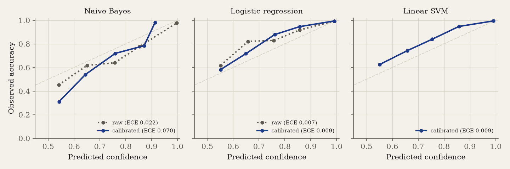

Expected calibration error on the Indian test set: logistic regression 0.009, linear SVM 0.009 (well
calibrated). Naive Bayes is 0.022 raw vs 0.070 after Platt scaling, because the scaling was fitted on
training data dominated by UK messages.

## Screenshots

| Analyze | Research results |
|---|---|
| 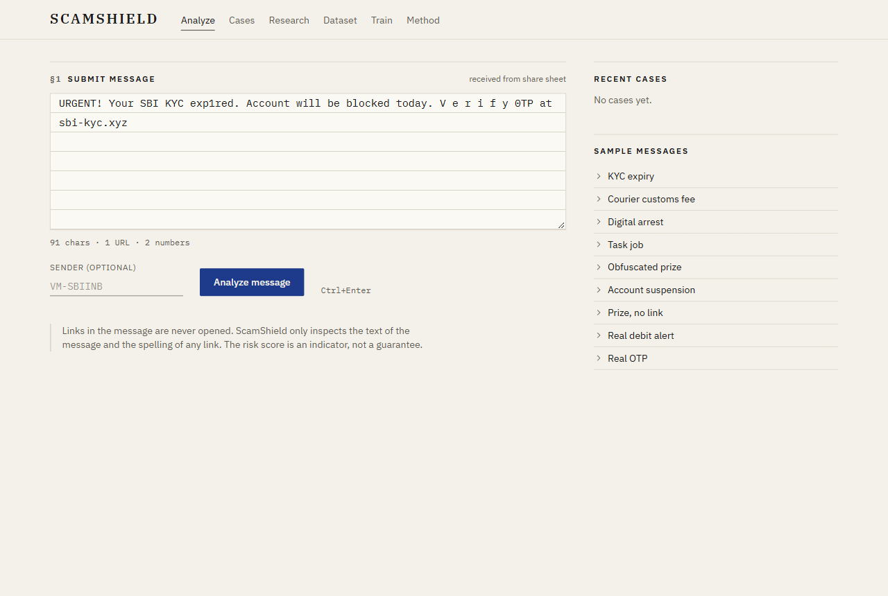 | 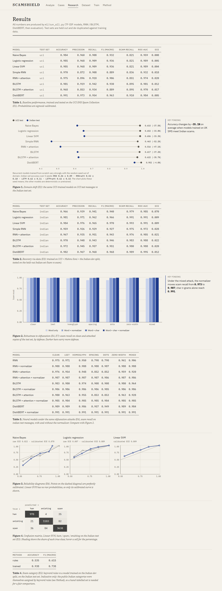 |
| **Dataset** | **Awareness quiz** |
| 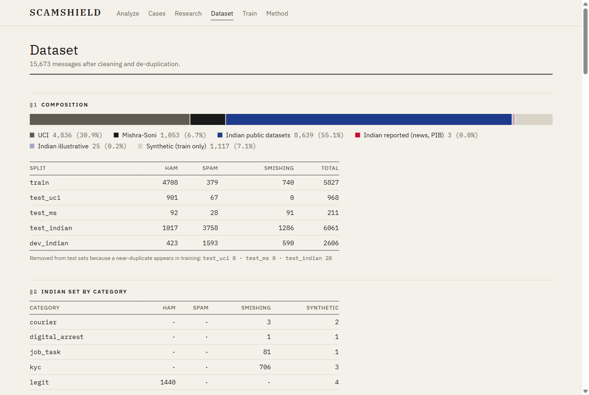 | 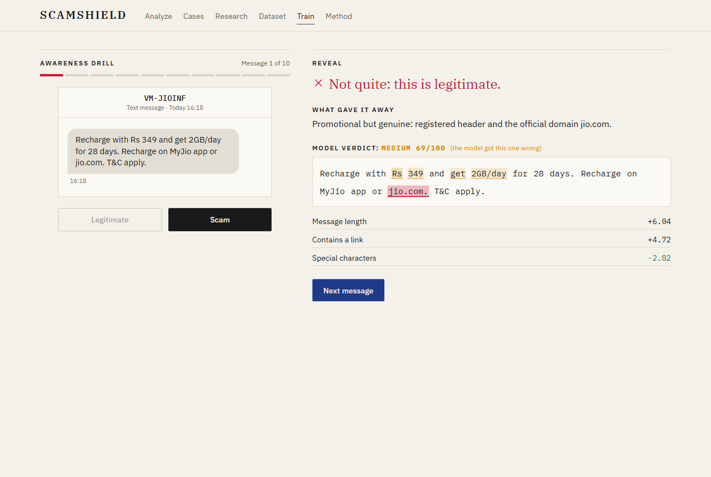 |
| **Method** | **Phone** |
| 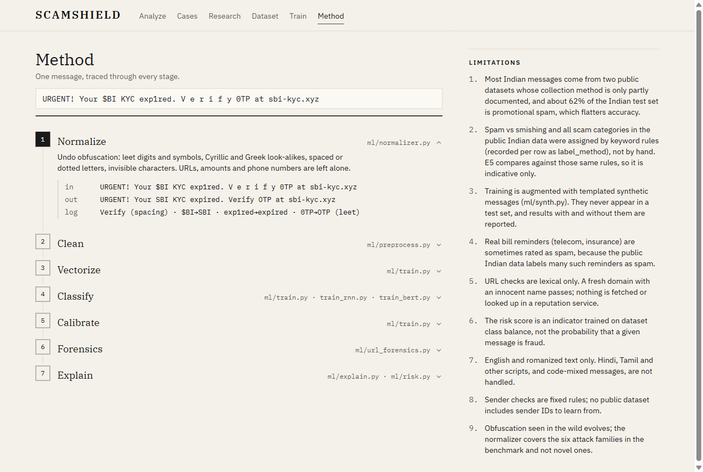 | 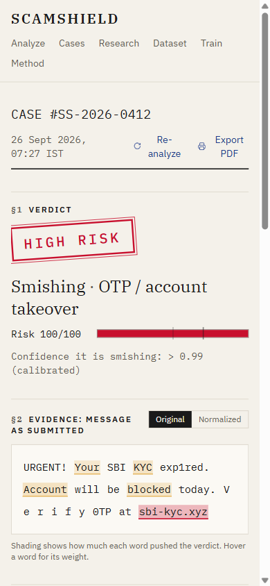 |

## Getting started

Requirements: Python 3.12, Node.js 20+.

```bash
git clone https://github.com/jeyadev-jd/ScamShield.git
cd ScamShield
python -m venv .venv
.venv/Scripts/python -m pip install -r requirements.txt     # Windows; use .venv/bin/python on macOS/Linux
npm --prefix frontend install
```

The trained models are included, so you can run the app straight away:

```bash
.venv/Scripts/python -m uvicorn backend.main:app --port 8000
npm --prefix frontend run dev                                  # open http://localhost:5173
```

### Reproduce the experiments

1. Download the four datasets into `data/raw/` (links in [data/raw/README.md](data/raw/README.md)).
2. Optional, for RNN/LSTM/DistilBERT: install PyTorch and Transformers (`requirements-bert.txt`; on an
   NVIDIA GPU use the CUDA build).
3. Run the whole pipeline (about 20 minutes with a GPU):

```bash
.venv/Scripts/python -m ml.run_all              # add --skip-neural for the TF-IDF models only
```

Individual steps: `ml.synth`, `ml.import_public`, `ml.build_dataset`, `ml.train`, `ml.train_rnn`,
`ml.train_bert`, `ml.evaluate`. Useful tools:

```bash
.venv/Scripts/python -m ml.normalizer "V e r i f y your 0TP at \$BI"          # try the normalizer
.venv/Scripts/python -m ml.obfuscate data/processed/test_indian.csv out.csv   # generate attacked copies
.venv/Scripts/python -m pytest -q                                            # 88 tests
```

The project report is generated from the results: `cd report && npm install && npm run build`.

## API

| Method | Endpoint | Returns |
|---|---|---|
| `POST` | `/api/analyze` | Full case report for `{"text": "...", "sender": "VM-SBIINB"}` (text up to 2,000 characters) |
| `GET` | `/api/health` | Model status and training metadata |
| `GET` | `/api/research` | Experiment results used by the Research page |
| `GET` | `/api/dataset` | Dataset summary and Indian specimens |

Example response (abridged):

```json
{
  "label": "smishing", "category": "otp_account", "probability": 1.0, "uncertain": false,
  "risk_score": 100, "risk_level": "HIGH",
  "obfuscation_detected": [{"from": "0TP", "to": "OTP", "kind": "leet"}],
  "url_analysis": {"domain": "sbi-kyc.xyz", "lookalike_of": "sbi.co.in", "suspicious_tld": true},
  "kill_chain": {"hook": "KYC expired", "urgency": "URGENT", "credibility": "SBI", "ask": "Verify OTP at sbi-kyc"},
  "indicators": [{"label": "Contains a link", "weight": 4.72}],
  "advice": ["Do not open the link, call back, or reply to the sender.", "..."]
}
```

Interactive docs: `http://localhost:8000/api/docs`. Messages are processed in memory and never logged.

## Deployment

**API (Docker: Render or Hugging Face Spaces).** The image needs no PyTorch; the deployed model is the SVM.
`requirements-api.txt` pins scikit-learn to the training version, because pickled models only load
reliably with the version that trained them.

```bash
docker build -t scamshield-api .
docker run -p 7860:7860 -e ALLOWED_ORIGINS=https://your-app.vercel.app scamshield-api
```

**Frontend (Vercel).** Root directory `frontend`, environment variable `VITE_API_URL` set to the API URL.

**Share to check (Android).** Open the deployed site in Chrome, install it, then share any SMS to
*ScamShield* from the messaging app. Share targets need HTTPS and an installed web app; iOS does not
support them.

## Project layout

```
ml/          normalizer, obfuscation attacks, features, URL forensics, dataset import and build,
             training (TF-IDF, RNN/LSTM with attention, DistilBERT), evaluation, explanations
backend/     FastAPI service and the deployed models
frontend/    React (Vite + Tailwind): Analyze, Case Report, Cases, Research, Dataset, Train, Method
data/raw/    dataset instructions and the Indian reported-message file
results/     metrics, figures and research.json
report/      project report (.docx) and its generator
docs/        screenshots
tests/       pytest suite (runs on small synthetic data)
```

## Limitations and future work

**Limitations**
- Most Indian messages come from public datasets whose collection method is only partly documented, and
  promotional spam dominates the Indian test set (62%).
- Spam vs smishing and scam categories in the public Indian data were assigned by keyword rules and
  spot-checked, not fully hand-labelled; E5 is therefore indicative.
- URL checks are lexical only; a new domain with an innocent name passes.
- English and romanised text only; Devanagari and other scripts are not handled.
- Some legitimate bill reminders are rated as spam, because the public data labels many of them as spam.
- The risk score reflects the training class balance; it is an indicator, not the probability that a
  given message is fraud.

**Future work**
- A hand-labelled Indian test set with scam categories, collected with consent.
- WhatsApp and multilingual (Hindi, Tamil, code-mixed) messages.
- On-device inference, so messages never leave the phone.
- Domain reputation lookups alongside lexical URL checks.

## References

1. T. A. Almeida, J. M. Gómez Hidalgo, A. Yamakami. *Contributions to the study of SMS spam filtering: new
   collection and results.* ACM DocEng 2011. Dataset: https://archive.ics.uci.edu/dataset/228/sms+spam+collection
2. S. Mishra, D. Soni. *SMS Phishing Dataset for Machine Learning and Pattern Recognition.* Mendeley Data,
   doi:10.17632/f45bkkt8pr.1
3. Indian Telecom SMS Spam Collection. https://github.com/junioralive/india-spam-sms-classification
4. ScamShield dataset. https://huggingface.co/datasets/sidzzz07/scamshield-dataset
5. V. Sanh, L. Debut, J. Chaumond, T. Wolf. *DistilBERT, a distilled version of BERT.* arXiv:1910.01108, 2019.
6. S. Hochreiter, J. Schmidhuber. *Long short-term memory.* Neural Computation, 1997.
7. D. Bahdanau, K. Cho, Y. Bengio. *Neural machine translation by jointly learning to align and translate.* ICLR 2015.
8. J. Platt. *Probabilistic outputs for support vector machines.* Advances in Large Margin Classifiers, 1999.
9. C. Guo, G. Pleiss, Y. Sun, K. Q. Weinberger. *On calibration of modern neural networks.* ICML 2017.
10. S. Eger et al. *Text processing like humans do: visually attacking and shielding NLP systems.* NAACL 2019.

## Author

**Jeyadev** ([@jeyadev-jd](https://github.com/jeyadev-jd))
